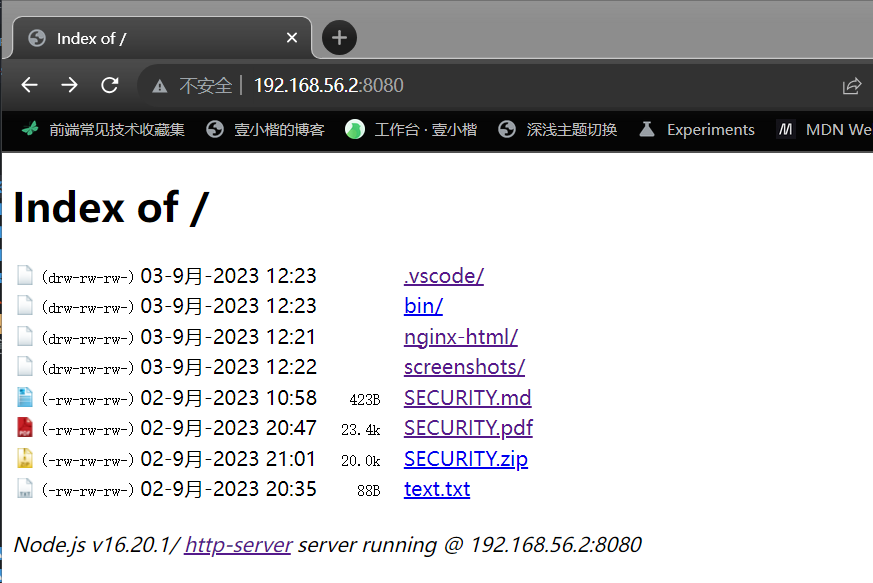

[](https://github.com/http-party/http-server/actions)
[](https://www.npmjs.com/package/http-server) [](https://formulae.brew.sh/formula/http-server) [](https://www.npmjs.com/package/http-server)
[](https://github.com/http-party/http-server)

# 源码调试

## 1. `node ./bin/http-server` 启动过程

首先，在项目根目录下创建 `.vscode/launch.json` 文件，内容如下：

```json
{
  // Use IntelliSense to learn about possible attributes.
  // Hover to view descriptions of existing attributes.
  // For more information, visit: https://go.microsoft.com/fwlink/?linkid=830387
  "version": "0.2.0",
  "configurations": [
    {
      "type": "node",
      "request": "launch",
      "name": "Launch Program",
      "skipFiles": [
        "<node_internals>/**"
      ],
      "program": "${workspaceFolder}\\bin\\http-server",
      "stopOnEntry": true,
      "console": "integratedTerminal"
    }
  ]
}
```

然后进入 `/bin/http-server` 文件中，敲击 `F5` 即可开始调试。


## 2. `http-server` 在一个拥有 `index.html` 文件的目录启动

当我们使用如下命令启动服务时：

```bash
$ http-server [path] [options]
```

当 `path` 未传入时，如果当前启动的目录中存在 `./public` 目录，则 `path` 默认是该 `./public`，否则 `path` 为 `./` 即当前目录。

因此，我们进入 `http-server-source-code-learning` 根目录，然后分别通过如下2个命令启动服务：

```bash
# 等价于：node ./bin/http-server ./public
$ node ./bin/http-server

# 显式指定路径为 ./nginx-html
$ node ./bin/http-server ./nginx-html
```

对于调试，我们需要修改 `.vscode/launch.json` 文件为：

```json
{
  // Use IntelliSense to learn about possible attributes.
  // Hover to view descriptions of existing attributes.
  // For more information, visit: https://go.microsoft.com/fwlink/?linkid=830387
  "version": "0.2.0",
  "configurations": [
    {
      "type": "node",
      "request": "launch",
      "name": "Launch Program",
      "skipFiles": [
        "<node_internals>/**"
      ],
      "program": "${workspaceFolder}\\bin\\http-server",
      "stopOnEntry": true,
      "console": "integratedTerminal",
      "args": ["./nginx-html"]
    }
  ]
}
```

然后进入 `/bin/http-server` 文件中，敲击 `F5` 即可开始调试。

调试时，记得在 `lib/core/index.js` 文件中的 `middleware` 函数中打上断点，文件处理核心逻辑在 `serve` 函数中。

在浏览器中打开 `http-server` 启动的服务页面后，理清楚代码执行流程。


## 3. `http-server` 在一个没有 `index.html` 文件的目录启动

通过如下命令指定 `path` 为当前根目录路径启动服务：

```bash
$ node ./bin/http-server ./dist
```

浏览器打开看到的页面如下：



对于调试，我们需要修改 `.vscode/launch.json` 文件为：

```json
{
  // Use IntelliSense to learn about possible attributes.
  // Hover to view descriptions of existing attributes.
  // For more information, visit: https://go.microsoft.com/fwlink/?linkid=830387
  "version": "0.2.0",
  "configurations": [
    {
      "type": "node",
      "request": "launch",
      "name": "Launch Program",
      "skipFiles": [
        "<node_internals>/**"
      ],
      "program": "${workspaceFolder}\\bin\\http-server",
      "stopOnEntry": true,
      "console": "integratedTerminal",
      "args": ["./dist"]
    }
  ]
}
```

记得在 `lib/core/index.js` 文件中的 `middleware` 函数中打上断点，文件夹处理核心逻辑在 `lib/core/show-dir` 目录中。

在浏览器中打开 `http-server` 启动的服务页面后，理清楚代码执行流程。


# http-server: a simple static HTTP server

`http-server` is a simple, zero-configuration command-line static HTTP server.  It is powerful enough for production usage, but it's simple and hackable enough to be used for testing, local development and learning.


## Installation:

#### Running on-demand:

Using `npx` you can run the script without installing it first:

    npx http-server [path] [options]

#### Globally via `npm`

    npm install --global http-server

This will install `http-server` globally so that it may be run from the command line anywhere.

#### Globally via Homebrew

    brew install http-server

#### As a dependency in your `npm` package:

    npm install http-server

## Usage:

     http-server [path] [options]

`[path]` defaults to `./public` if the folder exists, and `./` otherwise.

*Now you can visit http://localhost:8080 to view your server*

**Note:** Caching is on by default. Add `-c-1` as an option to disable caching.

## Available Options:

| Command         | 	Description         | Defaults  |
| -------------  |-------------|-------------|
|`-p` or `--port` |Port to use. Use `-p 0` to look for an open port, starting at 8080. It will also read from `process.env.PORT`. |8080 |
|`-a`   |Address to use |0.0.0.0|
|`-d`     |Show directory listings |`true` |
|`-i`   | Display autoIndex | `true` |
|`-g` or `--gzip` |When enabled it will serve `./public/some-file.js.gz` in place of `./public/some-file.js` when a gzipped version of the file exists and the request accepts gzip encoding. If brotli is also enabled, it will try to serve brotli first.|`false`|
|`-b` or `--brotli`|When enabled it will serve `./public/some-file.js.br` in place of `./public/some-file.js` when a brotli compressed version of the file exists and the request accepts `br` encoding. If gzip is also enabled, it will try to serve brotli first. |`false`|
|`-e` or `--ext`  |Default file extension if none supplied |`html` |
|`-s` or `--silent` |Suppress log messages from output  | |
|`--cors` |Enable CORS via the `Access-Control-Allow-Origin` header  | |
|`-o [path]` |Open browser window after starting the server. Optionally provide a URL path to open. e.g.: -o /other/dir/ | |
|`-c` |Set cache time (in seconds) for cache-control max-age header, e.g. `-c10` for 10 seconds. To disable caching, use `-c-1`.|`3600` |
|`-U` or `--utc` |Use UTC time format in log messages.| |
|`--log-ip` |Enable logging of the client's IP address |`false` |
|`-P` or `--proxy` |Proxies all requests which can't be resolved locally to the given url. e.g.: -P http://someurl.com | |
|`--proxy-options` |Pass proxy [options](https://github.com/http-party/node-http-proxy#options) using nested dotted objects. e.g.: --proxy-options.secure false ||
|`--username` |Username for basic authentication | |
|`--password` |Password for basic authentication | |
|`-S`, `--tls` or `--ssl` |Enable secure request serving with TLS/SSL (HTTPS)|`false`|
|`-C` or `--cert` |Path to ssl cert file |`cert.pem` |
|`-K` or `--key` |Path to ssl key file |`key.pem` |
|`-r` or `--robots` | Automatically provide a /robots.txt (The content of which defaults to `User-agent: *\nDisallow: /`)  | `false` |
|`--no-dotfiles` |Do not show dotfiles，即不展示类似 `.gitignore`、`.eslintrc.json` 这种文件| |
|`--mimetypes` |Path to a .types file for custom mimetype definition| |
|`-h` or `--help` |Print this list and exit. |   |
|`-v` or `--version`|Print the version and exit. | |

## Magic Files

- `index.html` will be served as the default file to any directory requests.
- `404.html` will be served if a file is not found. This can be used for Single-Page App (SPA) hosting to serve the entry page.

## Catch-all redirect

To implement a catch-all redirect, use the index page itself as the proxy with:

```
http-server --proxy http://localhost:8080?
```

Note the `?` at the end of the proxy URL. Thanks to [@houston3](https://github.com/houston3) for this clever hack!

## TLS/SSL

First, you need to make sure that [openssl](https://github.com/openssl/openssl) is installed correctly, and you have `key.pem` and `cert.pem` files. You can generate them using this command:

``` sh
openssl req -newkey rsa:2048 -new -nodes -x509 -days 3650 -keyout key.pem -out cert.pem
```

You will be prompted with a few questions after entering the command. Use `127.0.0.1` as value for `Common name` if you want to be able to install the certificate in your OS's root certificate store or browser so that it is trusted.

This generates a cert-key pair and it will be valid for 3650 days (about 10 years).

Then you need to run the server with `-S` for enabling SSL and `-C` for your certificate file.

``` sh
http-server -S -C cert.pem
```

If you wish to use a passphrase with your private key you can include one in the openssl command via the -passout parameter (using password of foobar)


e.g.
`openssl req -newkey rsa:2048 -passout pass:foobar -keyout key.pem -x509 -days 365 -out cert.pem`

For security reasons, the passphrase will only be read from the `NODE_HTTP_SERVER_SSL_PASSPHRASE` environment variable.


This is what should be output if successful:

``` sh
Starting up http-server, serving ./ through https

http-server settings:
CORS: disabled
Cache: 3600 seconds
Connection Timeout: 120 seconds
Directory Listings: visible
AutoIndex: visible
Serve GZIP Files: false
Serve Brotli Files: false
Default File Extension: none

Available on:
  https://127.0.0.1:8080
  https://192.168.1.101:8080
  https://192.168.1.104:8080
Hit CTRL-C to stop the server
```

# Development

Checkout this repository locally, then:

```sh
$ npm i
$ npm start
```

*Now you can visit http://localhost:8080 to view your server*

You should see the turtle image in the screenshot above hosted at that URL. See
the `./public` folder for demo content.
